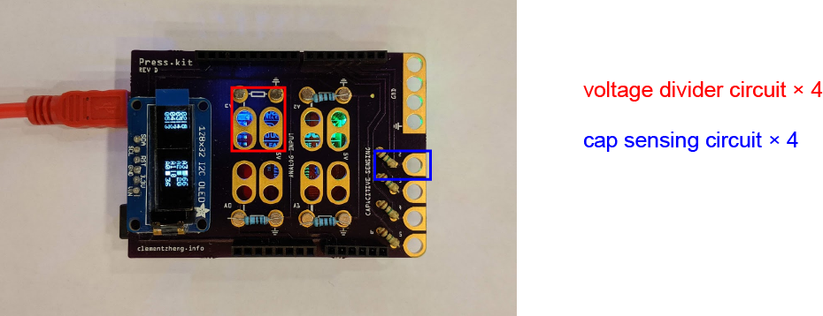
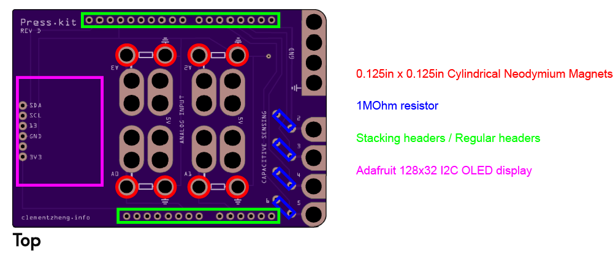

# PressKit

PressKit was made to rapidly prototype physical interfaces. As a breakout shield for the Arduino Uno (R3), PressKit provides four voltage divider circuits with analogRead, and four (capacitive) touch sensing pads using the CapacitiveSensing Arduino library. PressKit provides alligator clip friendly connections. A OLED display visualizes real time data coming from the eight inputs.

## PressKit serial communication
The input values are sent over USB serial&mdash;these values can be parsed and read with a script on the computer PressKit is connected to. See [this GitHub page](https://github.com/clementzheng/processing-quick-vis) for an example Processing sketch that visualizes these readings.

These values are formatted as a string, with each value separated with a space (`' '`), and each message separated with a line-break character (`\n`).

Order:
`cap2 cap3 cap4 cap5 a3 a2 a1 a0`

## PressKit assembly

| Part | Quantity | Description |
| --- | --- | --- |
| Arduino Uno R3 | 1 | Upload the code found [here](Arduino-code/) into the Arduino Uno. |
| PressKit PCB | 1 | Gerber Zip File for fabrication [here](PCB-fab/). Use a service like [JLCPCB](https://jlcpcb.com/) to make these boards. |
| Adafruit OLED 128x32 I2C display | 1 | [Adafruit Link](https://www.adafruit.com/product/931) [Digikey Link](https://www.digikey.com/catalog/en/partgroup/monochrome-i-c-oled-graphic-display/54832) |
| Arduino Uno stacking headers | 1 set | [Digikey link](https://www.digikey.com/catalog/en/partgroup/arduino-shield-stacking-headers/56138)  Alternatively, just use regular male headers. |
| 0.125in by 0.125in Cylindrical Neodymium Magnets | 8 | [Example](https://totalelement.com/collections/all-discs/products/1-8-x-1-8-inch-neodymium-rare-earth-cylinder-magnets-n48-200-pack) For connecting resistors to the voltage divider circuit. Solder the magnets to the back of the board. It helps to hold the magnets in place on a flat steel surface (e.g. paint scraper, fridge door) while soldering. |
| 1 MOhm resistor | 4 | For capacitive touch sensing. Each cap sense input requires 1 resistor. _Optional:_ to increase sensitivity, use a higher resistor value, e.g. 100 MOhm. |

Misc Items
| Part | Description |
| --- | --- |
| Alligator Clips | For connection to the copper rings on PressKit |
| USB cable | to connect the Arduino Uno to a computer |
| Resistor Booklet | Constant resistor for voltage divider circuits. |
